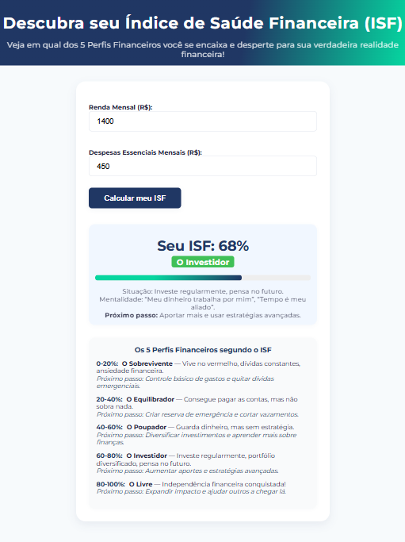

# 💰 Índice de Saúde Financeira (ISF)

Um aplicativo web simples e responsivo para ajudar usuários a descobrirem seu **Índice de Saúde Financeira (ISF)** com base na sua renda e nas despesas essenciais. O resultado revela em qual dos **5 perfis financeiros** o usuário se enquadra e oferece orientações práticas para evoluir financeiramente.

## 📸 Demonstração

<!-- Substitua 'preview.png' por uma imagem real se quiser -->


## 🚀 Funcionalidades

- Entrada de **renda mensal** e **despesas essenciais**
- Cálculo automático do ISF em porcentagem
- Classificação em um dos 5 perfis:
  - O Sobrevivente
  - O Equilibrador
  - O Poupador
  - O Investidor
  - O Livre
- Animações suaves e layout responsivo
- Dicas e próximos passos personalizados

## 🧮 Como o ISF é calculado?

text
ISF = ((Renda - Gastos Essenciais) / Renda) * 100
Quanto maior o ISF, melhor a saúde financeira. O valor é arredondado e limitado entre 0% e 100%.

## 🛠️ Tecnologias Utilizadas

| Tecnologia     | Descrição                                                       |
|----------------|-----------------------------------------------------------------|
| **HTML5**      | Estrutura da página, com elementos semânticos e acessíveis.     |
| **CSS3**       | Estilização com variáveis, animações, media queries e responsividade. |
| **JavaScript** | Lógica de cálculo do ISF, manipulação do DOM e interatividade.  |
| **Google Fonts** | Fonte personalizada (Montserrat) via CDN.                    |

---

## 📦 Como usar

1. Clone o repositório:
   ```bash
   git clone https://github.com/seu-usuario/isf-financeiro.git
2. Acesse a pasta:
    ```bash
    cd isf-financeiro
3. Abra o arquivo index.html no navegador:
    - Clique duas vezes no arquivo
    - Ou arraste-o para uma aba do navegador


## 📂 Estrutura do Projeto

📂 isf-financeiro
├── index.html         # Página principal
├── README.md          # Documentação
└── preview.png        # Imagem de exemplo
